# FiveByFive Semantic Layer — Entity Relationship Diagram

7 views exposed for querying. Arrows show how views relate through shared underlying cubes.

```mermaid
erDiagram
    AssetSummary {
        string id "dimension"
        string display_id "dimension"
        string asset_name "dimension"
        string asset_type "dimension"
        string structure_type "dimension"
        string asset_label "dimension"
        string latitude "dimension"
        string longitude "dimension"
        string asset_base_land_elevation_m "dimension"
        string has_fiber_joint "dimension"
        string count "measure"
        string avg_base_elevation "measure"
        string Sites_display_id "dimension"
        string Sites_site_name "dimension"
        string Sites_address_state "dimension"
        string Sites_address_region "dimension"
        string Sites_address_zip "dimension"
        string Sites_site_status "dimension"
        string Sites_terrain_category "dimension"
        string Sites_count "measure"
    }
    AssetVersionStatus {
        string id "dimension"
        string capture_date "dimension"
        string created_on "dimension"
        string active "dimension"
        string released "dimension"
        string capture_status "dimension"
        string processing_status "dimension"
        string packaging_status "dimension"
        string capture_type "dimension"
        string data_source "dimension"
        string last_analyst "dimension"
        string last_approved_by "dimension"
        string captured_by "dimension"
        string project_name "dimension"
        string height "dimension"
        string rad_count "dimension"
        string price_to_customer "dimension"
        string price_to_capture "dimension"
        string capture_due_date "dimension"
        string delivery_due_date "dimension"
        string ntp_date "dimension"
        string rejection_reason "dimension"
        string count "measure"
        string avg_price_to_customer "measure"
        string avg_price_to_capture "measure"
        string avg_height "measure"
        string total_price_to_customer "measure"
        string Assets_display_id "dimension"
        string Assets_asset_name "dimension"
        string Assets_asset_type "dimension"
        string Assets_structure_type "dimension"
        string Assets_Sites_site_name "dimension"
        string Assets_Sites_address_state "dimension"
        string Assets_Sites_address_region "dimension"
        string Companies_display_name "dimension"
    }
    CompanyAccessRights {
        string granted_on "dimension"
        string count "measure"
        string Companies_display_name "dimension"
        string AssetVersions_capture_date "dimension"
        string AssetVersions_processing_status "dimension"
        string AssetVersions_active "dimension"
    }
    DesignRevisions {
        string id "dimension"
        string revision_type "dimension"
        string design_state "dimension"
        string created_on "dimension"
        string count "measure"
        string AssetVersions_capture_date "dimension"
        string AssetVersions_active "dimension"
        string AssetVersions_project_name "dimension"
        string Assets_display_id "dimension"
        string Assets_asset_name "dimension"
        string Assets_asset_type "dimension"
        string Sites_site_name "dimension"
        string Sites_address_state "dimension"
    }
    EquipmentVolumes {
        string id "dimension"
        string display_name "dimension"
        string volume_type "dimension"
        string installation_status "dimension"
        string center_height "dimension"
        string dimension_1 "dimension"
        string dimension_2 "dimension"
        string dimension_3 "dimension"
        string azimuth "dimension"
        string downtilt "dimension"
        string roll "dimension"
        string count "measure"
        string AssetVersions_capture_date "dimension"
        string AssetVersions_processing_status "dimension"
        string AssetVersions_active "dimension"
        string AssetVersions_project_name "dimension"
        string Assets_display_id "dimension"
        string Assets_asset_name "dimension"
        string Assets_asset_type "dimension"
        string Sites_site_name "dimension"
        string Sites_address_state "dimension"
    }
    PhysicalComponentCatalog {
        string id "dimension"
        string manufacturer "dimension"
        string model_identifier "dimension"
        string family_identifier "dimension"
        string category "dimension"
        string primary_type "dimension"
        string shape "dimension"
        string height_m "dimension"
        string width_m "dimension"
        string depth_m "dimension"
        string diameter_m "dimension"
        string weight_kg "dimension"
        string count "measure"
    }
    SiteOverview {
        string id "dimension"
        string display_id "dimension"
        string site_name "dimension"
        string address_state "dimension"
        string address_region "dimension"
        string address_zip "dimension"
        string site_status "dimension"
        string terrain_category "dimension"
        string latitude "dimension"
        string longitude "dimension"
        string count "measure"
    }

    AssetSummary        ||--o{ SiteOverview           : "assets belong to sites"
    AssetVersionStatus  ||--o{ AssetSummary            : "versions of assets"
    EquipmentVolumes    ||--o{ AssetVersionStatus      : "volumes on versions"
    DesignRevisions     ||--o{ AssetVersionStatus      : "revisions on versions"
    CompanyAccessRights ||--o{ AssetVersionStatus      : "access to versions"
    PhysicalComponentCatalog ||--o{ EquipmentVolumes   : "components placed as volumes"
```

## View descriptions

| View | What it answers |
|---|---|
| `SiteOverview` | Sites by state, region, status, terrain |
| `AssetSummary` | Assets with site location and attributes |
| `AssetVersionStatus` | Full capture/processing/packaging lifecycle |
| `EquipmentVolumes` | 3D equipment placements on structures |
| `PhysicalComponentCatalog` | Hardware component specifications |
| `CompanyAccessRights` | Which companies can access which versions |
| `DesignRevisions` | Proposed equipment changes and design states |
